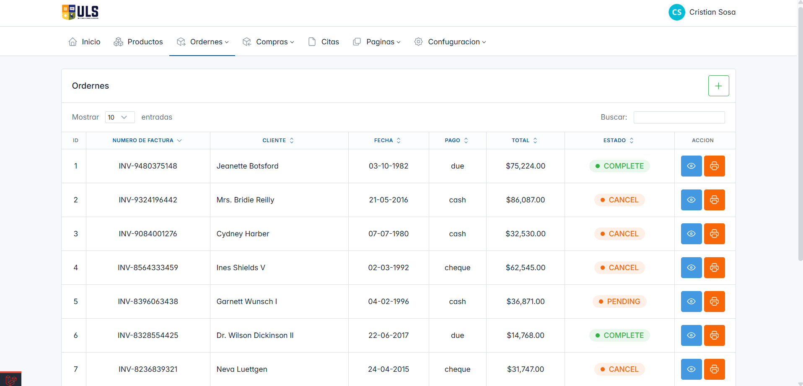

# Sistema de Gestión de Inventario CTRL-ULS

Un **Sistema de Gestión de Inventario para Centro de Computación** desarrollado con **Laravel 10** y **MySQL**, diseñado para optimizar el control de inventarios, ventas y procesos de compras.

##  Características Principales

- **Pedidos**
  - Pedidos Pendientes  
  - Pedidos Completos  
  - Pagos Pendientes
- **Compras**
  - Todas las Compras  
  - Proceso de Aprobación  
  - Reportes de Compras
- **Gestión de Productos**
- **Registro de Clientes**
- **Gestión de Proveedores**
