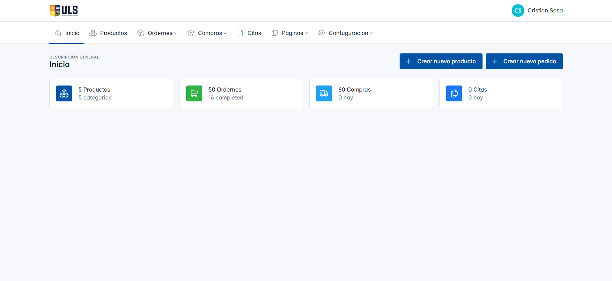
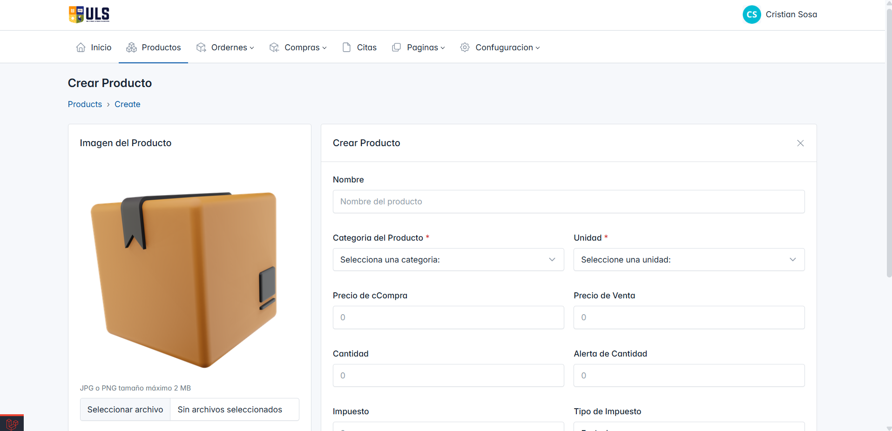

# ✨ Sistema de Gestión de Inventario

Un sólido **Sistema de Gestión de Inventario** desarrollado con **Laravel 10** y **MySQL**, diseñado para optimizar el control de inventarios, ventas y procesos de compras.

## 🖼️ Capturas del Sistema

> Vista general de los módulos y pantallas principales del sistema.  
> *(Agrega aquí tus 7 imágenes — puedes usar Markdown `` para cada una)*

  
<!-- 🧩 Agrega tus capturas a continuación -->

  

## 🗂️ Diseño de Base de Datos

El sistema se estructura con un esquema de base de datos claro y eficiente:

## 🌟 Características Principales

- **Punto de Venta (POS)**
- **Pedidos**
  - Pedidos Pendientes  
  - Pedidos Completos  
  - Pagos Pendientes
- **Compras**
  - Todas las Compras  
  - Proceso de Aprobación  
  - Reportes de Compras
- **Gestión de Productos**
- **Registro de Clientes**
- **Gestión de Proveedores**
